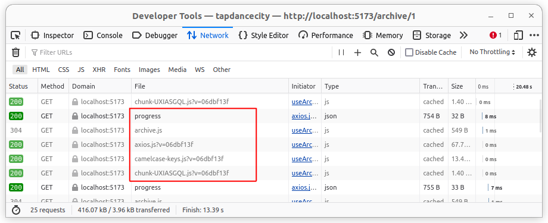
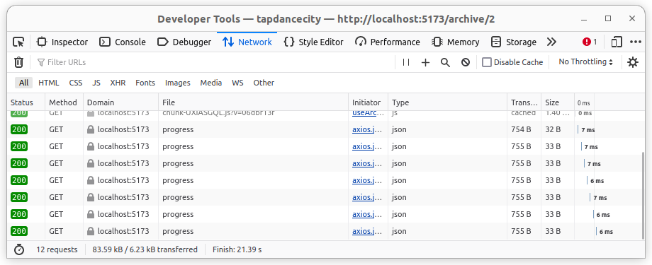

# Web Worker

Web Workerを使うユースケースがなかなか見いだせずにいたので、興味はあったのだがなかなか使う機会がなかった。
現在作成しているアプリケーションでは、というか大抵はSidekiqのジョブで非同期に処理することが多いので進捗を表示したいと思っていた。
いずれはWebSocketも使ってみたいのだが、まずはLong Pollingで実装してみようと思う。
最初はSSE(server-sent events)も使ってみたのだが、どうも安定しないのがあってLong Pollingにした。

まずWeb Workerにはおおまかに2種類のWorkerがあるようだ。

1つは専用Worker(DedicatedWorker)と共有Worker(SharedWorker)に分けられている。
若干使い方が異なるが、専用Workerはスクリプトファイルに紐付いていて、共有Workerはブラウザで共通のインスタンスを利用できるイメージ。
サンプルを試してみると専用Workerの方はセキュリティ系の拡張機能で無効にされていて、ひょっとすると共有Workerの方がいつでも使えるという意味ではいいかもしれない。
といっても自分で使うだけのアプリケーションなので今回は専用Workerを使う。

### 基本

**Create a Web Worker File:**

```javascript
// polling-worker.js
self.onmessage = function (e) {
  // This function will handle messages sent to the worker.
  // You can start the polling process here.
  poll(e.data.url, e.data.interval);
};

function poll(url, interval) {
  setInterval(async () => {
    try {
      const response = await fetch(url);
      if (response.ok) {
        const data = await response.json();
        self.postMessage(data); // Send data back to the main thread
      }
    } catch (error) {
      console.error("Polling error:", error);
    }
  }, interval);
}
```

**Main Thread:**

```javascript
// main.js
const worker = new Worker("polling-worker.js");

worker.onmessage = function (e) {
  // Handle data received from the worker.
  const data = e.data;
  console.log("Received data:", data);

  // You can update your UI or perform any other actions with the data.
};

// Start the polling process
const pollingConfig = {
  url: "https://example.com/api/data", // Replace with your API endpoint
  interval: 5000, // Polling interval in milliseconds (e.g., 5 seconds)
};

worker.postMessage(pollingConfig); // Start the polling
```

上記はChatGPTを利用して生成したコードだ。
`main.js`ファイルから専用Workerの`polling-worker.js`を呼び出している。

大まかな流れは`main.js`から`worker.postMessage`を呼び出して、`polling-worker.js`で`self.onmessage`に関数をセットすれば受け取ることができる。
逆に`polling-worker.js`側で計算した結果、今回はFetchを実行して取得したレスポンスを`self.postMessage`で返し、`main.js`側で`worker.onmessage`で受け取ることができる。
なんとなくWeb Workerは難しそうに思えていたが、基本の考え方はこれだけなので非常にわかりやすい。
`console.log`などのデバッグ関数も使えるのでAPI通信をすべてここに集約しようとまでは思わないが、今回のようなユースケースには非常に合致する。

このコードをベースに改良していく。

### Vite+Reactで使う

ViteでWeb Workerを使う際は特殊なURLを使用する。

```javascript
// App.jsx
import { useEffect } from "react";

function App() {
  useEffect(() => {
    if (window.Worker) {
      const scriptURL = new URL("./polling-worker.js", import.meta.url);
      const worker = new Worker(scriptURL, { type: "module" });

      worker.onmessage = function (e) {
        // Handle data received from the worker.
        const data = e.data;
        console.log("Received data:", data);

        // You can update your UI or perform any other actions with the data.
      };

      // Start the polling process
      const pollingConfig = {
        url: "https://example.com/api/data", // Replace with your API endpoint
        interval: 5000, // Polling interval in milliseconds (e.g., 5 seconds)
      };

      worker.postMessage(pollingConfig);
    } else {
      console.log("Your browser does'nt support web workers.");
    }
  }, []);

  return <></>;
}

export default App;
```

`import.meta.url`を渡すことでViteのコンパイラが正しくJSをインポートできる。
Workerに`{ type: "module" }`を渡すことでNPMのライブラリをインポートできるようにした。

```javascript
// polling-worker.js
import Axios from "axios";

self.onmessage = function (e) {
  // This function will handle messages sent to the worker.
  // You can start the polling process here.
  poll(e.data.url, e.data.interval);
};

function poll(url, interval) {
  setInterval(async () => {
    try {
      const response = await Axios.get(url);
      if (response) {
        self.postMessage(response.data); // Send data back to the main thread
      }
    } catch (error) {
      console.error("Polling error:", error);
    }
  }, interval);
}
```

ただし相対パスで書かれたファイルのインポートもできるかと思ったら、こちらはうまくいかなかった。
`import axios from './axios?worker'`みたいな書き方ができるかと思ったが、これはあくまでWeb Worker側の記載みたいなので違うらしい。
ここはわかり次第アップデートしたい。

### Long Pollingをとめる

お気づきかもしれないが、この記述のままではブラウザをリロードするまでは止まらない。
`postMessage`にbool値を渡して`setInterval`を解除するようにする。

```javascript
// App.jsx
import { useEffect } from "react";

function App() {
  useEffect(() => {
    if (window.Worker) {
      const scriptURL = new URL("./polling-worker.js", import.meta.url);
      const worker = new Worker(scriptURL, { type: "module" });

      worker.onmessage = function (e) {
        // Handle data received from the worker.
        const data = e.data;
        console.log("Received data:", data);

        // You can update your UI or perform any other actions with the data.
      };

      // Start the polling process
      const pollingConfig = {
        enabled: true,
        url: "https://example.com/api/data", // Replace with your API endpoint
        interval: 5000, // Polling interval in milliseconds (e.g., 5 seconds)
      };

      worker.postMessage(pollingConfig);

      return () => {
        worker.postMessage({
          enabled: false,
        });
      };
    } else {
      console.log("Your browser does'nt support web workers.");
    }
  }, []);

  return <></>;
}

export default App;
```

ここでは`useEffect`の返り値に関数を指定しているので、`App`コンポーネントのCleanupが呼び出される際に`postMessage`を送る。

```javascript
// polling-worker.js
import Axios from "axios";

let pollingIntervalId; // Store the interval ID for later cancellation

self.onmessage = function (e) {
  // This function will handle messages sent to the worker.
  // You can start the polling process here.
  if (e.data.enabled) {
    pollingIntervalId = poll(e.data.url, e.data.interval);
  } else {
    clearInterval(pollingIntervalId);
  }
};

function poll(url, interval) {
  return setInterval(async () => {
    try {
      const response = await Axios.get(url);
      if (response) {
        self.postMessage(response.data); // Send data back to the main thread
      }
    } catch (error) {
      console.error("Polling error:", error);
    }
  }, interval);
}
```

イメージ的にはこんな感じでよい。
この書き方はスレッドセーフなのか?という疑問もあったが、複数タブを開いて動かしてみても問題なかった。
おそらく専用Workerではこの書き方でもよいが、共有Workerだとこの書き方では対処できないのかもしれない。
他にもまだ防ぎきれないケースもあるかもしれないが、少なくとも私の使い方では問題なさそうである。

### useCallbackを適切に使う



この画像は実際に実装を進めていった時のリクエストを記録したものだ。
`progress`というエンドポイントで取得したレスポンスに加えて4つのjsファイルが含まれている。
記録されていたものはWorker内でインポートしたファイルだったが、原因はWorker内のスクリプトではなくReact側でstateを更新する際にフックで使用している関数を`useCallback`で括っていなかったからだ。

Pollingを行うごとに関数が作成されて、同じファイルのチャンクのインポートが無意味に繰り返されている。



修正後はPollingしているリクエストのみになった。
注意深くNetworkタブを見ていないと見落としがちな問題であるので、直接はWeb Workerとは関係ないが気をつけたい。
